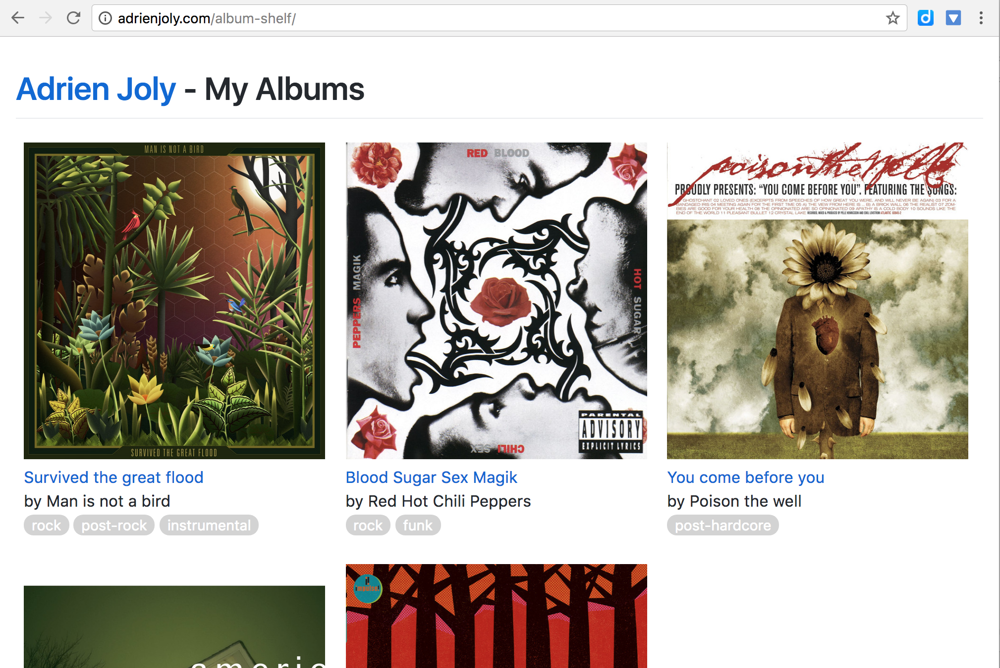

# Colección de discos

`album-shelf` is a static web page to display and explore my collection of music records.

Screenshot from [adrienjoly.com/album-shelf](https://adrienjoly.com/album-shelf):

It uses Jekyll to render the list in HTML from a YAML data file (see [`albums.yaml`](./_data/albums.yaml)) and Github-pages to make it accessible to the public.

If you want to have a similar page for your own album collection, feel free to fork this repository and replace my list of albums by yours!

## Como publicar tu propia colección?

> https://adrienjoly.com/album-shelf
